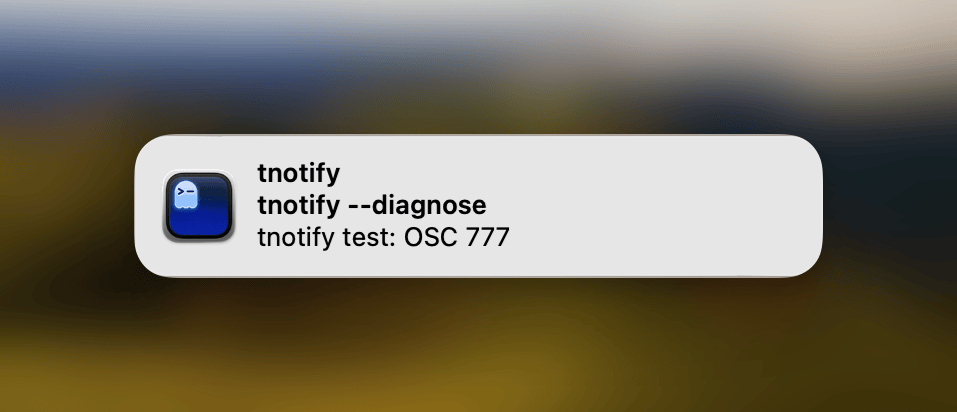
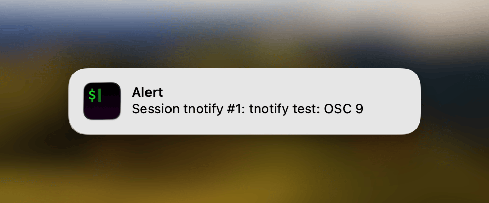
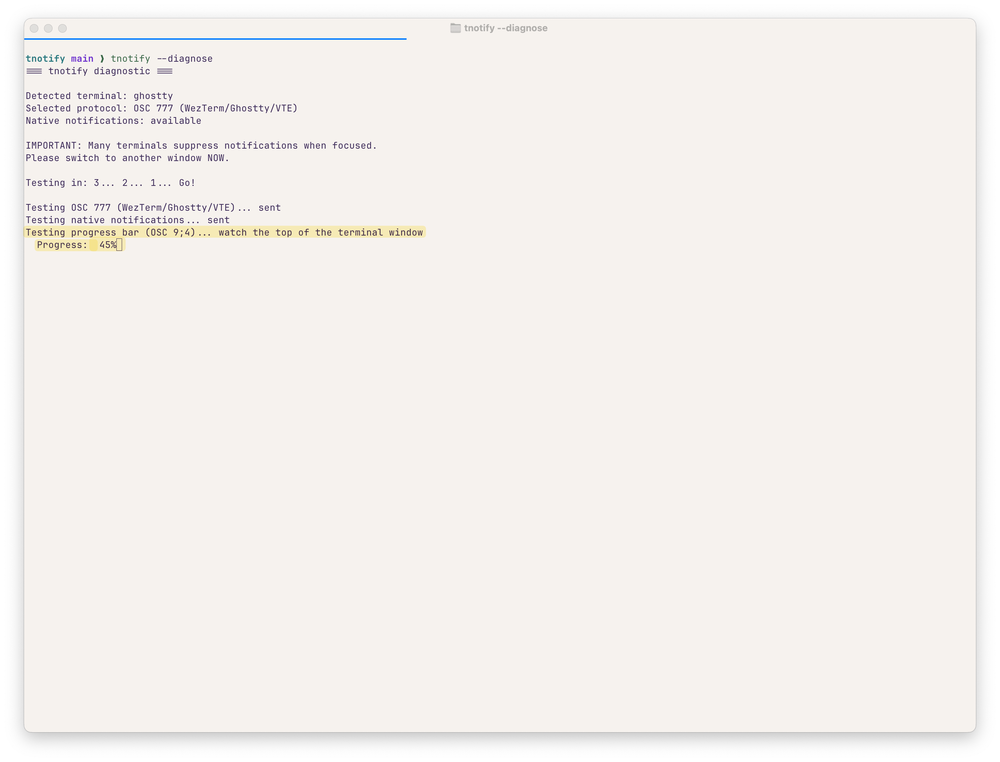
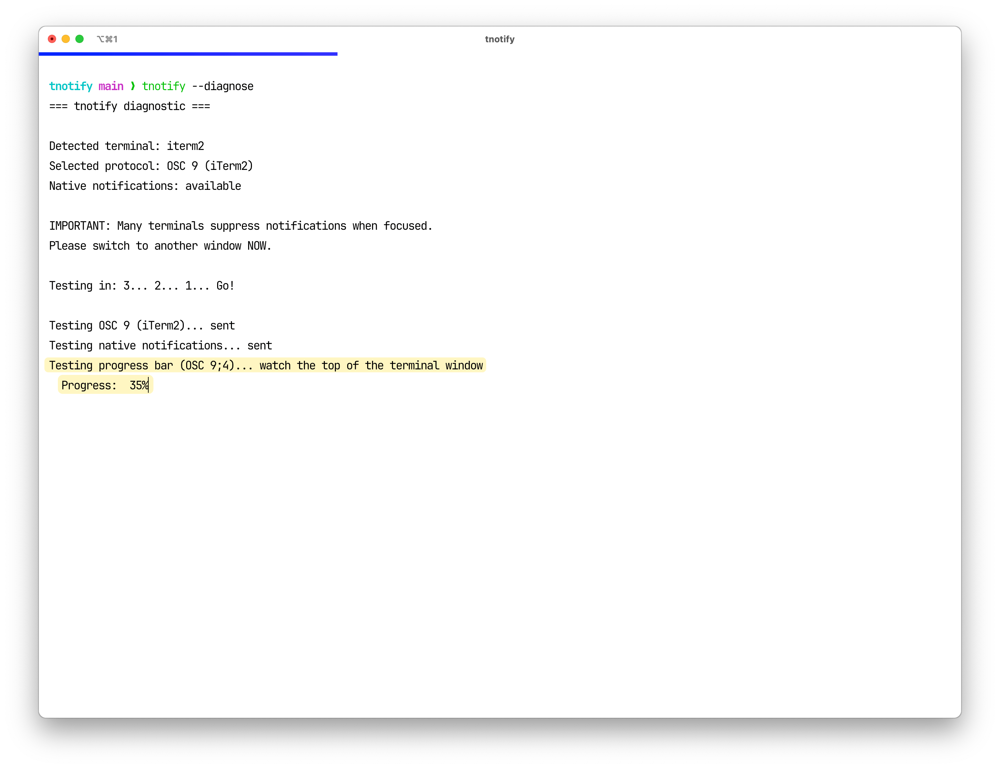
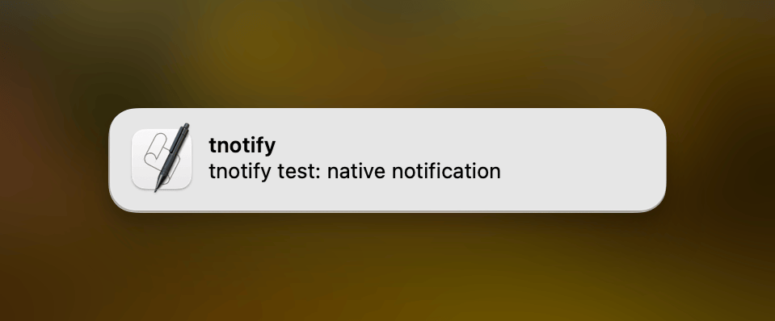
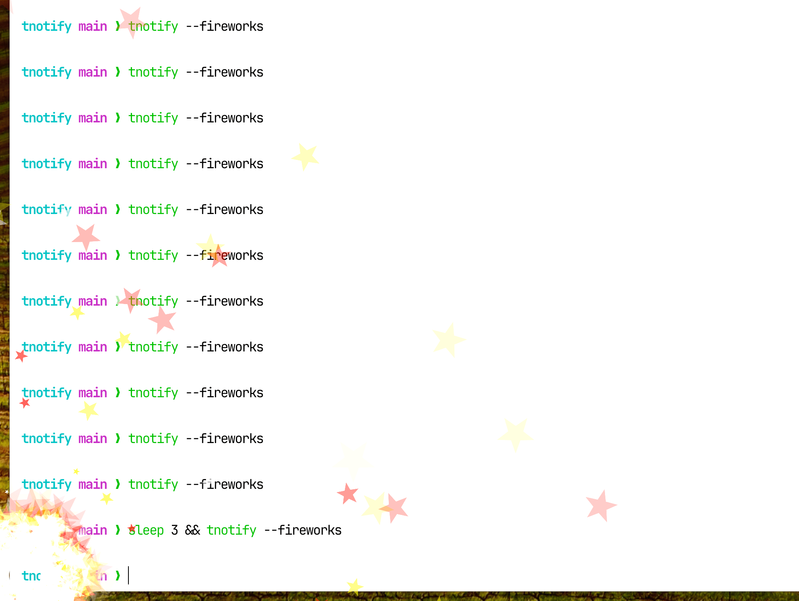

# Notify for Laravel

[](https://packagist.org/packages/soloterm/notify-laravel)
[](https://packagist.org/packages/soloterm/notify-laravel)
[](https://packagist.org/packages/soloterm/notify-laravel)

Laravel integration for [soloterm/notify](https://github.com/soloterm/notify) - send desktop notifications from Artisan commands via terminal OSC escape sequences.

This package was built to support [Solo](https://github.com/soloterm/solo), your all-in-one Laravel command to tame local development.

<table>
<tr>
<td><strong>OSC Notifications (Ghostty)</strong></td>
<td><strong>OSC Notifications (iTerm2)</strong></td>
</tr>
<tr>
<td></td>
<td></td>
</tr>
<tr>
<td><strong>Progress Bars (Ghostty)</strong></td>
<td><strong>Progress Bars (iTerm2)</strong></td>
</tr>
<tr>
<td></td>
<td></td>
</tr>
<tr>
<td><strong>macOS Fallback</strong></td>
<td><strong>Fireworks (iTerm2)</strong></td>
</tr>
<tr>
<td></td>
<td></td>
</tr>
</table>

## Installation

```bash
composer require soloterm/notify-laravel --dev
```

The service provider will be auto-discovered by Laravel.

## Quick Start

```php
use SoloTerm\Notify\Laravel\Facades\Notify;

// Simple notification
Notify::send('Build complete!');

// Semantic methods
Notify::success('All tests passed');
Notify::error('Build failed');
Notify::warning('Low disk space');
Notify::info('Background task started');
```

## Artisan Command

```bash
# Simple notification
php artisan notify "Build complete!"

# With a title
php artisan notify "All tests passed" --title="Tests"
php artisan notify "All tests passed" -t "Tests"

# Force a specific protocol
php artisan notify "Hello" --protocol=osc777
php artisan notify "Hello" -p osc9

# Check terminal support
php artisan notify --info

# Full diagnostics with interactive tests
php artisan notify:diagnose
```

### Exit Code Mode

Pipe the exit status of any command to get automatic success/failure notifications:

```bash
# Basic usage - $? contains the exit code of the previous command
php artisan test; php artisan notify --exit-code=$?

# With npm/node commands
npm run build; php artisan notify -e $?

# Custom messages
php artisan migrate; php artisan notify -e $? --success-message="Migrations done" --failure-message="Migration failed"

# Custom titles
phpunit; php artisan notify -e $? --success-title="PHPUnit" --failure-title="PHPUnit"
```

## Facade

The `Notify` facade provides convenient access to all notification features:

```php
use SoloTerm\Notify\Laravel\Facades\Notify;

// Basic notifications
Notify::send('Message', 'Title');
Notify::send('Message', 'Title', Notify::URGENCY_CRITICAL);

// Semantic methods with default titles from config
Notify::success('Task completed');     // Title: "Success"
Notify::error('Something went wrong'); // Title: "Error", critical urgency
Notify::warning('Check this out');     // Title: "Warning"
Notify::info('FYI');                   // Title: "Info", low urgency

// Other methods
Notify::sendOrBell('Message');         // Falls back to bell if unsupported
Notify::sendAny('Message');            // Uses OSC or external fallback
Notify::bell();                        // Just the bell character
```

## Scheduler Integration

Notify when scheduled tasks complete - perfect for long-running commands:

```php
// In routes/console.php or app/Console/Kernel.php

// Notify after task completes
$schedule->command('backup:run')
    ->daily()
    ->thenNotify('Backup complete!');

// Notify with custom title
$schedule->command('reports:generate')
    ->hourly()
    ->thenNotify('Reports ready', 'Reports');

// Notify only on success
$schedule->command('sync:data')
    ->everyFiveMinutes()
    ->thenNotifySuccess('Sync completed');

// Notify only on failure
$schedule->command('payments:process')
    ->hourly()
    ->thenNotifyFailure('Payment processing failed!');

// Notify on both success and failure
$schedule->command('deploy:production')
    ->daily()
    ->withNotification();  // Uses command name for messages

// Custom messages for both outcomes
$schedule->command('cleanup:logs')
    ->weekly()
    ->withNotification(
        successMessage: 'Cleanup finished',
        failureMessage: 'Cleanup failed',
        title: 'Maintenance'
    );
```

## Event Listener

Automatically notify when Artisan commands complete:

```php
// In config/notify.php
'events' => [
    'command_finished' => [
        'enabled' => true,  // or env('NOTIFY_ON_COMMAND_FINISHED', false)
        'success_title' => 'Command Completed',
        'failure_title' => 'Command Failed',
    ],
    'excluded_commands' => [
        'notify',
        'list',
        'help',
        // Add commands you don't want notifications for
    ],
],
```

## Log Channel

Send log messages as desktop notifications:

```php
// In config/logging.php
'channels' => [
    // ... other channels ...

    'notify' => [
        'driver' => 'custom',
        'via' => \SoloTerm\Notify\Laravel\Logging\CreateNotifyLogger::class,
        'level' => 'warning',  // Only warning and above
        'title' => 'My App',
    ],
],
```

Then use it:

```php
use Illuminate\Support\Facades\Log;

// Send to notify channel
Log::channel('notify')->error('Database connection lost!');
Log::channel('notify')->warning('High memory usage');

// Or add to your stack
'stack' => [
    'driver' => 'stack',
    'channels' => ['daily', 'notify'],
],
```

Log levels map to urgency:
- `emergency`, `alert`, `critical`, `error` → Critical urgency
- `warning`, `notice` → Normal urgency
- `info`, `debug` → Low urgency

> **Note:** This log channel is designed for CLI usage (Artisan commands, queue workers, scheduled tasks). In web requests, there's no terminal attached, so notifications are silently skipped. For web request logging, use a different channel in your stack.

## Progress Bars

Display progress in the terminal tab/taskbar for long-running commands:

```php
use SoloTerm\Notify\Laravel\Facades\Notify;

// Check if the terminal supports progress bars
if (Notify::supportsProgress()) {
    // Show progress (0-100)
    Notify::progress(25);
    Notify::progress(50);
    Notify::progress(100);

    // Clear when done
    Notify::progressClear();
}
```

### Progress States

```php
// Normal progress (blue/default)
Notify::progress(75);

// Error state (red)
Notify::progressError(100);

// Paused state (yellow)
Notify::progressPaused(50);

// Indeterminate/pulsing
Notify::progressIndeterminate();

// Hide/clear
Notify::progressClear();
```

### Terminal Support

Progress bars are supported in:
- **Windows Terminal** - Full support
- **Ghostty** - Full support (1.2+)
- **iTerm2** - Full support (3.6.6+)
- **ConEmu/Mintty** - Full support

## Queue Worker Notifications

Get notified when queue workers start processing and when they stop:

```php
// In AppServiceProvider or a dedicated provider
use Illuminate\Queue\Events\JobProcessing;
use Illuminate\Queue\Events\WorkerStopping;
use Illuminate\Support\Facades\Event;
use SoloTerm\Notify\Laravel\Facades\Notify;

public function boot(): void
{
    // Notify when queue starts processing (first job only)
    $notified = false;
    Event::listen(JobProcessing::class, function () use (&$notified) {
        if (!$notified) {
            Notify::info('Queue worker started processing', 'Queue');
            $notified = true;
        }
    });

    // Notify when queue worker stops
    Event::listen(WorkerStopping::class, function () {
        Notify::warning('Queue worker stopping', 'Queue');
    });
}
```

## SendsNotifications Trait

Add notification capabilities to any Artisan command:

```php
<?php

namespace App\Console\Commands;

use Illuminate\Console\Command;
use SoloTerm\Notify\Laravel\Concerns\SendsNotifications;

class BuildProject extends Command
{
    use SendsNotifications;

    protected $signature = 'build:project';

    public function handle(): int
    {
        $this->info('Building project...');

        // ... build logic ...

        // Simple notification
        $this->notify('Build completed!', 'Build');

        // Convenience methods with preset titles
        $this->notifySuccess('All tests passed');
        $this->notifyError('Build failed');
        $this->notifyWarning('Low disk space');

        // Check if notifications are supported
        if ($this->canNotify()) {
            $this->notify('This terminal supports notifications!');
        }

        return self::SUCCESS;
    }
}
```

## Configuration

Publish the config file:

```bash
php artisan vendor:publish --tag=notify-config
```

This creates `config/notify.php`:

```php
return [
    // Default title when none specified
    'default_title' => env('NOTIFY_DEFAULT_TITLE', 'Laravel'),

    // Titles for semantic methods
    'titles' => [
        'success' => 'Success',
        'error' => 'Error',
        'warning' => 'Warning',
        'info' => 'Info',
    ],

    // Force a specific protocol (null for auto-detect)
    'force_protocol' => env('NOTIFY_FORCE_PROTOCOL'),

    // Enable external fallback (notify-send, osascript, etc.)
    'enable_fallback' => env('NOTIFY_ENABLE_FALLBACK', true),

    // Event listener configuration
    'events' => [
        'command_finished' => [
            'enabled' => env('NOTIFY_ON_COMMAND_FINISHED', false),
            'success_title' => 'Command Completed',
            'failure_title' => 'Command Failed',
        ],
        'excluded_commands' => [
            'notify', 'list', 'help', 'env',
            'schedule:run', 'queue:work', 'queue:listen',
        ],
    ],
];
```

## Terminal Compatibility

| Terminal | Support | Notes |
|----------|:-------:|-------|
| **iTerm2** | ✅ | macOS |
| **Kitty** | ✅ | Cross-platform, full-featured |
| **WezTerm** | ✅ | Cross-platform |
| **Ghostty** | ✅ | Cross-platform |
| **tmux** | ✅ | Requires config below |
| **Alacritty** | ⚠️ | Falls back to system notifications |
| **Terminal.app** | ⚠️ | Falls back to system notifications |

### tmux Configuration

For notifications to work inside tmux, add to `~/.tmux.conf`:

```bash
set -g allow-passthrough on
```

Then reload: `tmux source-file ~/.tmux.conf`

## Requirements

- PHP 8.1+
- Laravel 10, 11, or 12
- A supported terminal emulator (or system notification tools for fallback)

## Related Projects

Part of the SoloTerm ecosystem:

- [Solo](https://github.com/soloterm/solo) - All-in-one Laravel command for local development
- [Screen](https://github.com/soloterm/screen) - Pure PHP terminal renderer
- [Dumps](https://github.com/soloterm/dumps) - Laravel command to intercept dumps
- [Grapheme](https://github.com/soloterm/grapheme) - Unicode grapheme width calculator
- [Notify](https://github.com/soloterm/notify) - PHP package for desktop notifications via OSC escape sequences
- [TNotify](https://github.com/soloterm/tnotify) - Standalone, cross-platform CLI for desktop notifications
- [VTail](https://github.com/soloterm/vtail) - Vendor-aware tail for Laravel logs

## License

The MIT License (MIT).

## Support

This is free! If you want to support me:

* Check out my courses:
    * [Database School](https://databaseschool.com)
    * [Screencasting](https://screencasting.com)
* Help spread the word about things I make

## Credits

Developed by Aaron Francis.

* Twitter: https://twitter.com/aarondfrancis
* Website: https://aaronfrancis.com
* YouTube: https://youtube.com/@aarondfrancis
